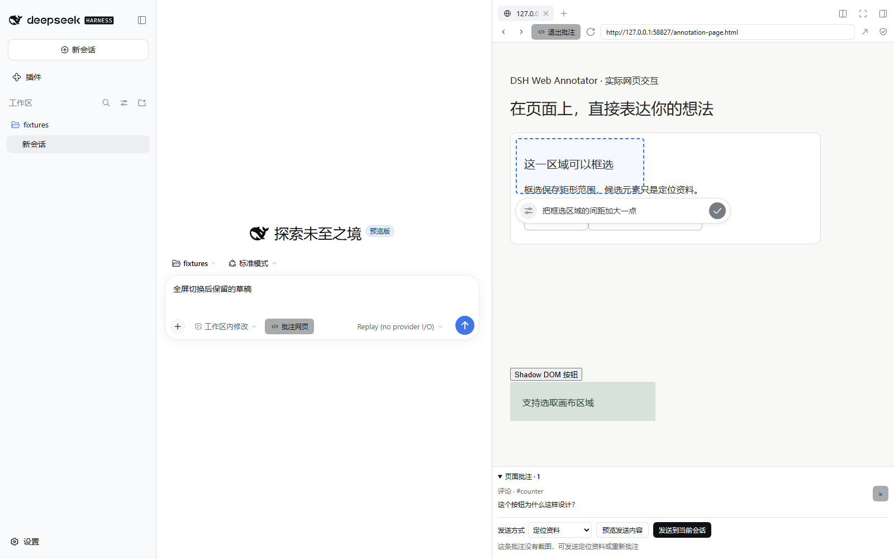
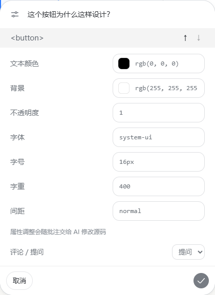

# DSH Web Annotator · 网页批注与提问

在 Harness 原有 Browser 标签页里，点击或框选网页，然后就地添加评论、向当前 Agent 提问。

[](https://github.com/cslkkl/dsh-web-annotator/actions/workflows/ci.yml)
[](LICENSE)
[](.node-version)
[](docs/browser-integration.md)



## 它能做什么

- **就地批注**：点选元素、点击空白位置，或拖动框选矩形区域，在选区旁写评论或提问。
- **边看边改属性**：展开同一张属性卡片调整颜色、字体、间距，改动随批注交给 Agent，保存前不改写网页。
- **临时操作网页**：按住空格键与网页交互，松开回到批注；输入框里的空格照常打字。
- **带图或带定位资料发送**：截图会用蓝框或蓝圈标出所选位置，并叠加与附图一致的序号徽标；
  没有截图时可只发坐标与 DOM 证据，也可两者一起发。
- **聊天里一眼看清**：本插件发出的批注消息只显示“N 条注释”，展开后逐条给出序号、目标元素与
  你的评论／提问；完整定位资料仍在同一个折叠里。
- **多条管理**：保存后可编辑、逐条勾选、分批发送；失败保留，成功只移除本次发出去的。
- **草稿不丢**：按会话与完整 URL 存进 IndexedDB；发送失败或保存失败都不会清空内容。

**0.2.0-alpha 是预览版，精确支持 Harness 0.2.0-rc.2。**
一个预构建安装包同时包含插件和 Browser、Chat、Layout 扩展，安装后正常重启 Desktop 即可使用。
扩展尚未合入官方 Harness；npm 尚未发布，插件市场尚未收录。
每个版本的安装包与验证记录由[发布链路](.github/workflows/release.yml)在标签上构建并附到 Release。

## 安装

从 [预览 Release](https://github.com/cslkkl/dsh-web-annotator/releases) 下载最新 `dsh-web-annotator-*.tgz`，
在 DSH 插件管理页选择该本地包，或使用官方 CLI：

```sh
dsh plugin --profile desktop add --ignore-scripts /absolute/path/dsh-web-annotator-<版本>.tgz
```

只装这一个包，然后正常退出并重开 Desktop。使用其他 Profile 时替换 `desktop`。
包内已有运行产物，不需要用户编译或放行构建脚本。

该 bundle 在启用期间**替换官方 Browser、Chat 和 Layout 提供方**。
请先确认 Harness 内核是 **0.2.0-rc.2**，不要在其他版本或另一套同类提供方上混装。
卸载整个 bundle 会撤销这些替换，重启后恢复官方提供方。

旧本地预览用户先移除 `dsh-layout-care` 和 `dsh-layout-care-browser-preview` 再安装新包。
已有批注会自动迁移。详见 [安装和市场发布](docs/distribution.md)。

## 使用方式

1. 在当前会话点击“批注网页”，打开 Harness 原有的 Browser。
2. 输入网页地址，点击工具栏中“刷新”左边的“批注网页”。
3. 点击元素或空白位置，或者拖动鼠标框选区域，在选区旁输入内容。
4. 浮层默认只有选项图标、输入区和圆形 ✓。点左侧图标展开属性卡片，查看标签、颜色、字体等，
   也可切换“评论／提问”和元素层级。点击 ✓ 或按 Enter 保存；Shift+Enter 换行并自动增高；
   Esc 先收起卡片，再取消批注。
5. 需要操作网页时按住空格键，松开回到批注。
6. 保存后可编辑文字，勾选本次要发送的批注，再选择发送方式，预览后发送到当前会话。



图片通过 Harness 的正式图片附件流程发送。图片模式只发批注正文、网页 URL 和对应截图；
详细模式保留坐标与 DOM 证据，但聊天默认只显示“N 条注释”，点击展开逐条卡片（序号、目标元素、
评论或提问），再点“查看定位资料”展开完整请求；附件截图上的序号与卡片序号一致。
模型能否直接识别图片取决于当前模型的图片能力。

## 当前支持范围

| 能力                                           | 状态                                     |
| ---------------------------------------------- | ---------------------------------------- |
| 原有 Browser 工具栏与网页内批注浮层            | 已验证                                   |
| 元素点选、空白位置、矩形框选、空格临时操作     | 已验证                                   |
| 多条批注、预览、失败重试、会话请求与持久化日志 | 已验证（模型端用官方 replay）            |
| 图片附件与详细资料折叠                         | 已验证；Electron 截图边界用测试替代      |
| 聊天内“N 条注释”折叠与逐条卡片                 | 已验证（附件序号徽标随图片模式验收）     |
| Desktop 原生网页点选、属性卡片与原生截图       | 人工验证过，未随每次发布复验             |
| **真实模型据此修改源码**                       | **尚未验收**                             |
| 其他远程页面                                   | 逐个页面分别验收；Web 仍受跨源与嵌入限制 |
| iframe 内部与 closed Shadow DOM 的子元素       | 只定位外层载体，不能穿透                 |

逐项的验证边界与手工清单见 [验证说明](docs/verification.md)。

## 接入自己的 Vite 页面

```ts
import { defineConfig } from 'vite';
import { webAnnotator } from 'dsh-web-annotator/vite';

export default defineConfig({ plugins: [webAnnotator()] });
```

只在开发服务器生效。JSX/TSX 原生标签会附带文件、行、列提示；生产构建不注入连接脚本或源码标记。
连接默认允许 HTTP loopback 的 Harness；其他来源通过 `allowedParentOrigins` 指定精确 HTTP(S) origin。

可运行示例见 [examples/responsive-demo](examples/responsive-demo/README.md)。

## 安全与边界

- 页面里的文字、样式和源码标记一律是**引用资料**，不是指令。
- 插件回调只暴露有界数据与动作，**不向页面暴露 DOM、任意求值器或宿主能力**。
- 批注与截图只存在你本机的浏览器存储中，通过当前会话的正常请求流程发送。
- 文件写入与源码修改由你当前会话中的 Agent 完成，插件本身不执行任何脚本。

## 许可与参与

MIT 许可证，见 [LICENSE](LICENSE)。第三方声明见 [THIRD_PARTY_NOTICES.md](THIRD_PARTY_NOTICES.md)。

欢迎用真实页面复现问题、改进交互、补测试或完善文档，见 [CONTRIBUTING.md](CONTRIBUTING.md)。

维护者文档地图、构建与门禁命令见 [AGENTS.md](AGENTS.md)。
