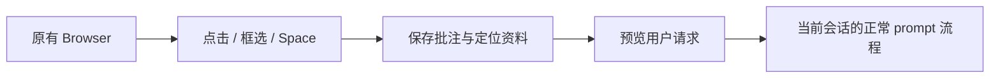

# 架构

插件通过随包分发的 Browser 提供方声明的 `sidebar.right.tab.browser.toolbar` 和 `sidebar.right.tab.browser.annotations` 子插槽添加控件与批注队列。提供方沿用 Harness 原有 Browser，并增加两个插槽及受限的 `annotate` / `cancelAnnotation` 回调。为在原版 rc.2 使用这些接口，bundle 层替换官方 Browser、Chat 和 Layout 提供方，卸载整个 bundle 可撤销替换。

`src/browser/page-inspector.ts` 是自包含的页面 picker。Web 开发连接直接运行它；Desktop 提供方只执行静态的编译后 picker，不给插件任意 JavaScript 求值器、DOM、Electron 或 Node 能力。`src/browser/protocol.ts` 校验跨进程 / MessagePort 数据。`src/browser/iframe-annotation.ts` 限制目标 origin，使用单独 MessageChannel，处理取消、导航、超时与回收。

四个共同模块在 Browser 补丁中保留同步副本；`scripts/sync-browser-provider.mjs` 更新副本，构建脚本检查一致性。公开稳定接口应在官方 Browser 中维护，目前仍是针对精确 rc.2 基线的本地扩展。

`src/client/annotation-store.ts` 声明由渲染器管理的会话级 store。完整 URL 是队列键，批注有独立 ID；一次发送成功只删除捕获的 ID，防止同时添加的批注丢失。`src/browser/prompt.ts` 保留评论 / 提问意图，把网页资料当作引用，并明确矩形与候选元素的关系。

picker 用透明选取层拦截网页指针；元素证据记录 selector、open Shadow DOM 路径、文档矩形、文本、少量计算样式和可选源码标记。区域以鼠标起止点计算文档坐标，采集最多 12 个候选元素；空白位置保存 point。输入最多 1000 字符，一页最多 32 条批注，跨页面结果与过大的请求会被拒绝。

选区和编辑浮层跟随滚动与元素布局变化；拖动中按空格或 pointercancel 会终止当前手势。空格松开、失焦或页面隐藏恢复批注，防止模式卡住。Escape、页面导航、卸载、取消和超时都会释放 overlay、监听器与动画。

编辑浮层默认是一行胶囊。左侧图标展开同一张属性卡片；元素的 CSS 调整写入 `styleChanges`，保存前不修改网页，点击外部或按 Esc 收起并保留草稿；下一次 Esc 取消整条批注。换行自动增高并重新约束浮层位置。注入网页的 UI 保持自包含，在 Shadow DOM 中使用固定样式与公共图标的静态图形；不会载入 Harness 的 React 运行时。

Desktop 保存后捕获真实视口，`screenshot.ts` 将准确选区画在 JPEG 上；截图不进入 DOM JSON。图片通过正式 `Session.prompt` 图片部件和 `beginSubmission` 预览提交，Host 负责校验、归一化和持久化。定位模式保留完整可重放证据；`conversation.message.user-text` chain 仅接管经过完整格式与协议校验的 DSH Web Annotator 请求，默认显示用户文字并折叠资料；其他消息使用宿主 fallback。

没有像素比较或独立自动修改引擎。Web 不能突破跨源 / 嵌入策略；closed Shadow DOM 与嵌套 iframe 内部不提供精确元素证据。文本和源码提示都需要 Agent 在工作区核实。
